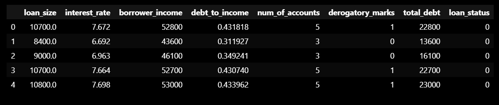
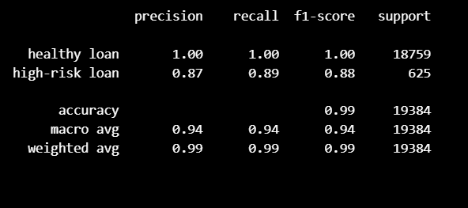

# credit-risk-classification
#### Purpose of the analysis:
Here the provided data is based on lending activity.Each row of the dataset indicates the details of a borrower.
So the purpose of this challennge is to use various techniques to train and evaluate a model based on loan risk and build a model that can identify the creditworthiness of borrowers.

#### Overview of the Analysis:

* As the first step the providede dataset is readed as a dataframe and split it into X and y variables.
* Created the labels set 'y'  from the 'loan_status' column, and the features 'X' DataFrame from the remaining columns.
* Seperated the data into training and testing datasets by using 'train_test_split'.
* To create a Logistic Regression Model with the Original Data, instantiated a Logistic Regression model as 'model' and assigned random_state parameter as 1 to the model.
* Fit the model using training data.
* Made prediction using the testing data and using this prediction a classification report is generated.

#### Results:

From the above classification report,we will get a clean idea about the accuracy scores,precision and recall scores of the machine learning model.

* Accuracy:

Here the overall accuracy is 0.99, which means 99% of the predictions made by the model are correct.

* Precision:

    As per the classification report,

    * Precision for 'healthy loan' is 1.00 (or 100%). This means when the model predicts a loan as 'healthy', it is correct all the time.

    * Precision for 'high-risk loan' is 0.87 (or 87%). This means when the model predicts a loan as 'high-risk', it is correct 87% of the time.

* Recall:

    * Recall for 'healthy loan' is 1.00 (or 100%). This means the model correctly identifies all 'healthy loans' in the dataset.

    * Recall for 'high-risk loan' class: Recall is 0.89 (or 89%). This means the model correctly identifies 89% of the 'high-risk loans' in the dataset.

#### Summary:

* The model performs very well overall with high accuracy 99%.

* It shows perfect performance for the 'healthy loan' class.

* For the 'high-risk loan' class, it maintains a good precision (87%) and recall (89%), with an F1-score of 0.88.

In conclusion, based on this classification report, the logistic regression model predicts both healthy loans and high-risk loans quite well, with near-perfect performance for healthy loans and solid performance for high-risk loans.